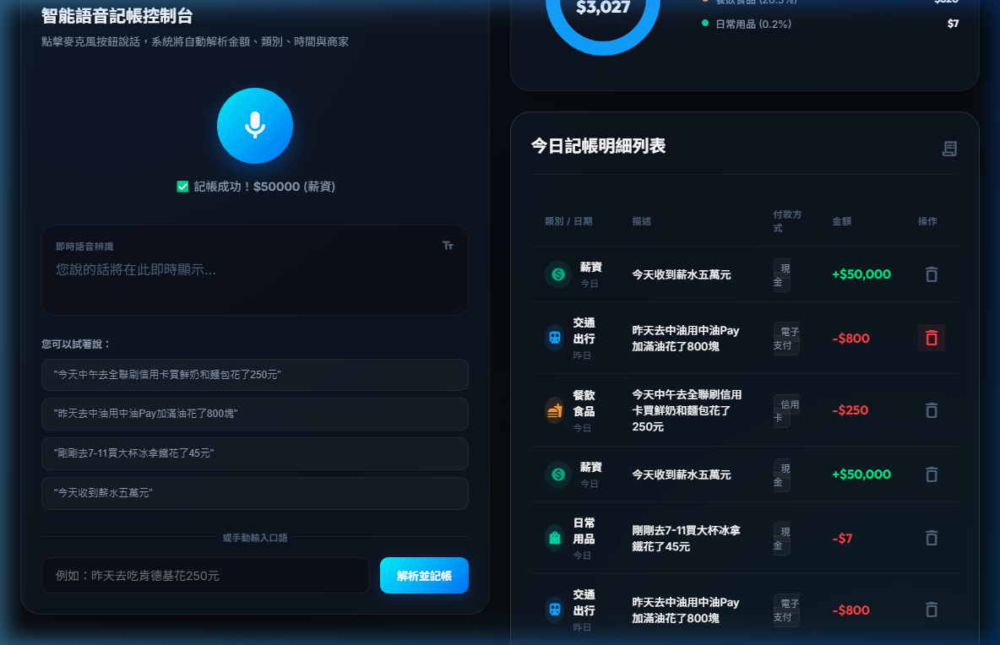

<div align="center">

# 🎙️ Voice Finance — 語音記帳軟體

[](https://flutter.dev)
[](https://dart.dev)
[](https://python.org)
[](https://ai.google.dev)

**說一句話，AI 幫你自動記帳** 💰

用語音輕鬆完成日常記帳，Gemini AI 智能解析語意、自動分類、辨識金額

[功能特色](#-功能特色) · [技術架構](#-技術架構) · [快速開始](#-快速開始) · [Live Demo](#-live-demo)

</div>

---

## 🚀 Live Demo

### 🌐 Web App 互動操作展示 (Web App Walkthrough)

下面是 Web 版本的實際操作展示（使用 Web Speech API 或手動輸入口語語句自動解析並記帳）：


*圖：Web 版記帳完成後的最終儀表板與支出分析圓餅圖統計*


> 🔗 **[📱 線上展示 (Web 版)](https://voice-finance-demo.web.app)** *(部署中)*
>
> 🔗 **[📦 下載 APK (Android)](https://github.com/asia17242/Ai-Study/releases/tag/day003-v1.0)** *(即將推出)*

| 平台 | 狀態 |
|------|------|
| 🌐 Web | 🟢 已完成測試與錄影 |
| 🤖 Android | 🚧 開發中 |
| 🍎 iOS | 🚧 開發中 |
| 🪟 Windows | 🚧 開發中 |
| 🍏 macOS | 🚧 開發中 |
| 🐧 Linux | 🚧 開發中 |

---

## ✨ 功能特色

### 🎤 語音記帳
> *「今天午餐吃了一百二十元」* → 自動記錄 **餐飲 $120**

- 一句話完成記帳，不需要手動輸入
- 支援自然語言，怎麼說都聽得懂
- 多語系語音辨識（中文 / English）

### 🤖 AI 智能分類
- **Gemini API** 驅動的語意解析引擎
- 自動辨識：金額、類別、日期、備註
- 智能分類：餐飲、交通、購物、娛樂、醫療...

### 📊 視覺化分析
- 月度支出趨勢圖
- 分類佔比圓餅圖
- 每日消費時間軸
- 預算追蹤與提醒

### 📱 跨平台支援
- Flutter 一套程式碼，六大平台通用
- 原生效能，流暢體驗
- 響應式設計，自適應各種螢幕尺寸

---

## 🏗️ 技術架構

```
┌─────────────────────────────────────────────┐
│                  Frontend                    │
│              Flutter (Dart)                  │
│         Clean Architecture + BLoC            │
├─────────────────────────────────────────────┤
│                                              │
│  ┌──────────┐  ┌──────────┐  ┌───────────┐  │
│  │   語音    │  │   交易    │  │   分析    │  │
│  │  Feature  │  │  Feature  │  │  Feature  │  │
│  └────┬─────┘  └────┬─────┘  └─────┬─────┘  │
│       │              │              │         │
│  ┌────▼──────────────▼──────────────▼─────┐  │
│  │          Domain Layer (UseCases)        │  │
│  └────────────────┬───────────────────────┘  │
│                   │                           │
│  ┌────────────────▼───────────────────────┐  │
│  │         Data Layer (Repositories)       │  │
│  └────────────────┬───────────────────────┘  │
│                   │                           │
├───────────────────┼─────────────────────────┤
│                   ▼                           │
│  ┌─────────────────────────────────────────┐ │
│  │         Backend (Python)                 │ │
│  │       Gemini API + NLP Pipeline          │ │
│  └─────────────────────────────────────────┘ │
└─────────────────────────────────────────────┘
```

### 技術棧明細

| 層級 | 技術 | 說明 |
|------|------|------|
| **前端框架** | Flutter 3.x | 跨平台 UI 框架 |
| **程式語言** | Dart | Flutter 原生語言 |
| **狀態管理** | BLoC Pattern | 可預測的狀態管理 |
| **架構模式** | Clean Architecture | 分層解耦架構 |
| **後端語言** | Python | AI 處理核心 |
| **AI 引擎** | Google Gemini API | 語意理解與分類 |
| **語音辨識** | Speech-to-Text | 平台原生語音 API |
| **本地儲存** | SQLite / Hive | 離線交易紀錄 |

---

## 📁 專案結構

```
Day-003/
├── shared/                      # 共用常數 (分類表、商家對照)
│   └── categories.py
├── voice_finance/               # Flutter 跨平台應用
│   ├── lib/
│   │   ├── core/                # 核心層 (DI, 主題, API 服務, 工具)
│   │   │   ├── constants/
│   │   │   ├── di/
│   │   │   ├── services/
│   │   │   ├── theme/
│   │   │   └── utils/
│   │   ├── features/record/     # 記帳業務模組
│   │   │   ├── data/            # 資料層 (Hive, Model, RepoImpl)
│   │   │   ├── domain/          # 領域層 (Entity, UseCase, Repository)
│   │   │   └── presentation/    # 展示層 (Pages, Widgets, BLoC)
│   │   │       ├── bloc/
│   │   │       ├── pages/
│   │   │       └── widgets/
│   │   └── main.dart
│   ├── backend/                 # Python FastAPI 後端
│   │   ├── gemini_service.py    # Gemini 2.5-Flash 解析服務
│   │   ├── main.py              # FastAPI 入口
│   │   └── requirements.txt
│   ├── backend_poc/             # AI 解析 PoC 驗證
│   ├── test/
│   └── pubspec.yaml
├── voice_finance_web/           # Web 獨立應用
│   ├── app.py                   # FastAPI 路由層
│   ├── services/                # 解析服務模組
│   │   ├── schemas.py
│   │   ├── normalizer.py
│   │   ├── vendor_mapper.py
│   │   ├── mock_parser.py
│   │   └── gemini_parser.py
│   └── static/
│       ├── index.html
│       ├── style.css
│       └── js/
│           ├── anime.js
│           ├── charts.js
│           ├── storage.js
│           └── app.js
├── Milestone1_Report.md
└── README.md
```

---

## 🚀 快速開始

### 環境需求

| 工具 | 最低版本 |
|------|----------|
| Flutter | >= 3.10 |
| Dart | >= 3.0 |
| Python | >= 3.10 |
| Android Studio / Xcode | 最新版 |

### 安裝步驟

```bash
# 1. 克隆專案
git clone https://github.com/asia17242/Ai-Study.git
cd Ai-Study/Day-003/voice_finance

# 2. 安裝 Flutter 依賴
flutter pub get

# 3. 設定環境變數
cp .env.example .env
# 編輯 .env 填入你的 Gemini API Key

# 4. 啟動應用
flutter run                  # 預設平台
flutter run -d chrome        # Web 版
flutter run -d windows       # Windows 版
flutter run -d android       # Android 版
```

### 後端設定

```bash
cd backend
pip install -r requirements.txt
python main.py
```

---

## 🗺️ 開發路線圖

- [x] 專案初始化與架構設計
- [ ] 語音辨識模組
- [ ] Gemini AI 語意解析
- [ ] 交易 CRUD 功能
- [ ] 分類管理系統
- [ ] 支出統計圖表
- [ ] 預算提醒功能
- [ ] 多帳戶支援
- [ ] 資料匯出（CSV / PDF）
- [ ] 雲端同步

---

## 📝 授權條款

本專案為 [AI Study](https://github.com/asia17242/Ai-Study) 系列的 Day 003 作品，採用 MIT License 授權。

---

<div align="center">

**Built with ❤️ and 🤖 AI**

*Day 003 of AI Study Challenge*

[](https://github.com/asia17242/Ai-Study)

</div>
